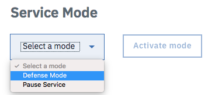

---
copyright:
  years: 2018
lastupdated: "2018-03-15"
---

{:shortdesc: .shortdesc}
{:new_window: target="_blank"}

# Distributed Denial of Service (DDoS) Concept

## What is a DDoS attack?
A distributed denial of service (DDoS) attack is a malicious attempt to disrupt normal traffic of a targeted server, service, or network by overwhelming the target or its surrounding infrastructure with a flood of Internet traffic. DDoS attacks achieve effectiveness by utilizing multiple compromised computer systems as sources of attack traffic. Exploited machines can include computers and other networked resources such as IoT devices. From a high level, a DDoS attack is like a traffic jam clogging up a highway, preventing regular traffic from arriving at its desired destination.

## How does a DDoS attack work?
An attacker gains control of a network of online machines in order to carry out a DDoS attack. Computers and other machines (such as IoT devices) are infected with malware, turning each one into a bot (or zombie). The attacker then has remote control over the group of bots, which is called a botnet. 

After establishing a botnet, the attacker can direct the machines by sending updated instructions to each bot via remote control. A targeted IP address receives requests from a multitude of bots, causing the targeted server or network to overflow capacity. This creates a denial-of-service to normal traffic. Because each bot is a legitimate Internet device, separating the attack traffic from normal traffic can be difficult. 

## What are common types of DDoS attacks?
Different DDoS attack vectors target varying components of a network connection. While nearly all DDoS attacks involve overwhelming a target device or network with traffic, attacks can be divided into three categories. An attacker may use one or multiple attack vectors, and may even cycle attack vectors based on countermeasures taken by the target.

###	Application Layer Attacks
Sometimes referred to as a layer 7 DDoS attack (in reference to the 7th layer of the OSI 	model), the goal of these attacks is to exhaust the resources of the target. The attacks target the layer where web pages are generated on the server and delivered in response to HTTP requests. Layer 7 attacks are challenging to defend because the traffic can be difficult to flag as malicious.

###	Protocol Attacks
Protocol attacks, also known as a state-exhaustion attacks, cause a service disruption by consuming all the available state table capacity of web application servers or intermediate resources like firewalls and load balancers. Protocol attacks utilize weaknesses in layer 3 and layer 4 of the protocol stack to render the target inaccessible.
  
###	Volumetric Attacks
This category of attacks attempts to create congestion by consuming all available bandwidth between the target and the wider Internet. Large amounts of data are sent to a target by using a form of amplification, or other means of creating massive traffic, such as requests from a botnet.

## What do I do if I’m under a DDoS attack?

**Step 1:** Turn on “Defense mode" from the **Overview** screen. 

**Step 2:** Set your DNS records for maximum security.

**Step 3:** Do not rate-limit or throttle requests from IBM CIS, we need the bandwidth to assist you with your situation.

**Step 4:** Block specific countries and visitors if necessary.
