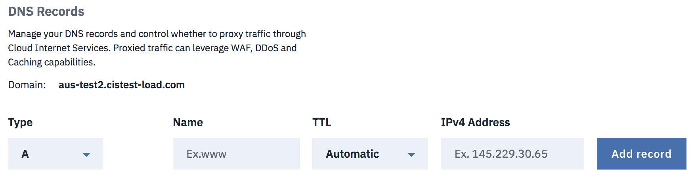
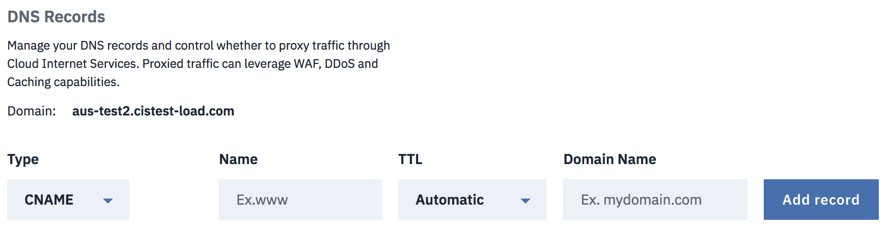
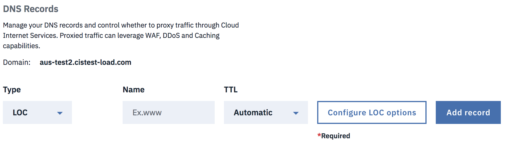
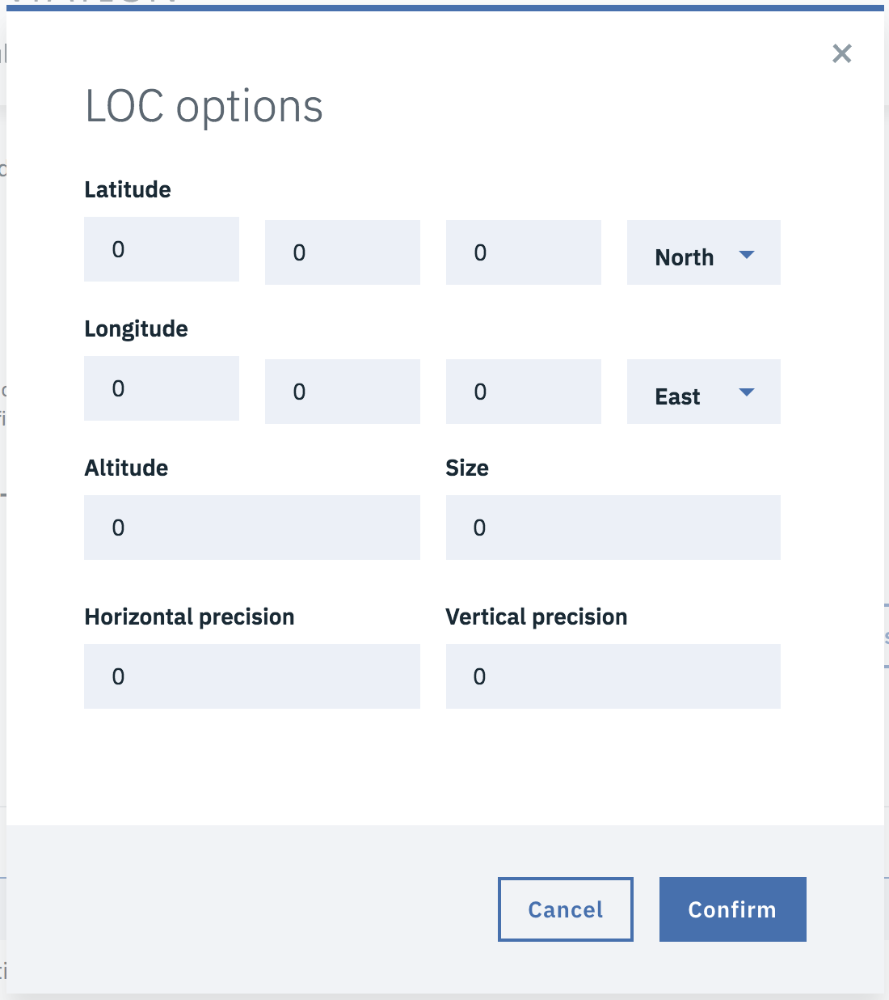
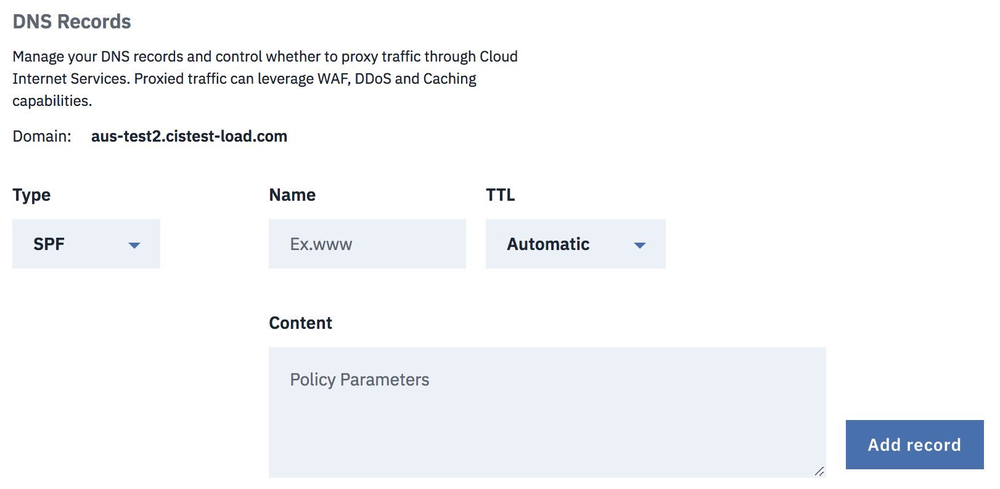
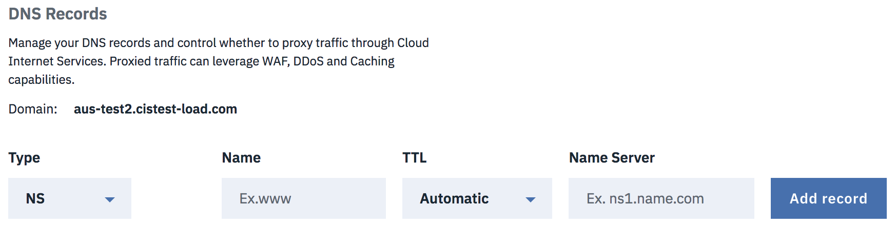
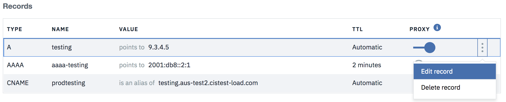
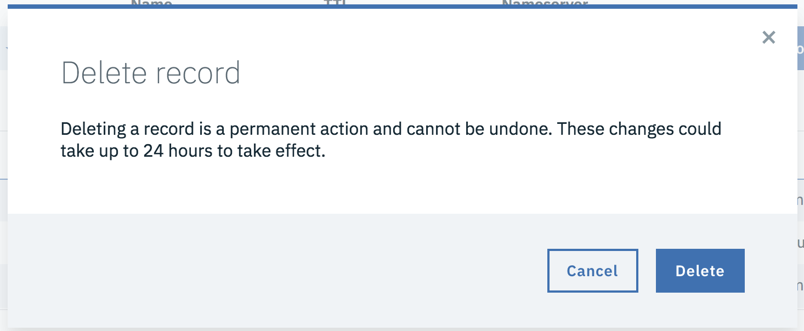
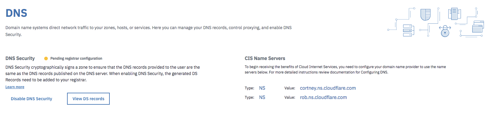

---

copyright:
  years: 2018
lastupdated: "2018-03-05"

---

# Adding records

You can use the **Type** dropdown to select the type of record you may want to create.

### A Type record

To add this record type, there must be valid values in the **Name** and **IPv4 Address** fields. A **Time-To-Live (TTL)** can also be specified from the dropdown, with the default value for this being 'Automatic'.

    Required Fields: Name, IPv4 Address
    Optional Field: TTL (Default value is Automatic)

### AAAA Type record

To add this record type, there must be valid values in the **Name** and **IPv6 Address** fields. A **Time-To-Live (TTL)** can also be specified from the dropdown, with the default value for this being 'Automatic'.

    Required Fields: Name, IPv6 Address
    Optional Field: TTL (Default value is Automatic)

### CNAME Type record

To add this record type, there must be a valid value in the **Name** field and a fully qualified domain in the **Domain Name** field. A **Time-To-Live (TTL)** can also be specified from the dropdown, with the default value for this being 'Automatic'.

    Required Fields: Name, Domain Name (for CNAME)
    Optional Field: TTL (Default value is Automatic)

### MX Type record

To add this record type, there must be a valid value in the **Name** field and a valid address in the **Mail Server** field. A **Time-To-Live (TTL)** can also be specified from the dropdown, with the default value for this being 'Automatic'.

    Required Fields: Name, Mail Server
    Optional Fields: TTL (Default value is Automatic), Priority (Default value is 1)

### LOC Type record

To add this record type, there must be a valid value in the **Name** field. There is also a **Configure LOC options** button, which will open a dialog to update more specific information. A **Time-To-Live (TTL)** can also be specified from the dropdown, with the default value for this being 'Automatic'.

    Required Fields: Name
    Optional Fields: LOC options (click the button to configure)

### CAA Type record

To add this record type, there must be valid values in the **Name** and **Value** fields. Value will correlate to the value of the **Tag** dropdown field, which defaults to "Send violation reports to URL". **A Time-To-Live (TTL)** can also be specified from the dropdown, with the default value for this being 'Automatic'.

    Required Fields: Name, Value (associated to tag)
    Optional Fields: TTL (Default value is Automatic), Tag (default is to send violation reports to URL)

### SRV Type record

To add this record type, there must be valid values in the **Name**, **Service Name** and **Target** fields. A **protocol** can also be selected via dropdown, with the default value being UDP protocol. Additionally, **Priority**, **Weight** and **Port** can all be specified by the user and all three of these fields default to 1 from the start. A **Time-To-Live (TTL)** can also be specified from the dropdown, with the default value for this being 'Automatic'.

    Required Fields: Name, Service Name, Target
    Optional Fields: TTL (Default value is Automatic), Protocol (Defaulted to UDP), Priority (Defaulted to 1), Weight (Defaulted to 1), Port (Defaulted to 1)

### SPF Type record

To add this record type, there must be valid values in the **Name** and **Content** fields. A **Time-To-Live (TTL)** can also be specified from the dropdown, with the default value for this being 'Automatic'.

    Required Fields: Name, Content
    Optional Field: TTL (Default value is Automatic)

### TXT Type record

To add this record type, there must be valid values in the **Name** and **Content** fields. A **Time-To-Live (TTL)** can also be specified from the dropdown, with the default value for this being 'Automatic'.

    Required Fields: Name, Content
    Optional Field: TTL (Default value is Automatic)

### NS Type record

To add this record type, there must be valid values in the **Name** and **Name Server** fields. A **Time-To-Live (TTL)** can also be specified from the dropdown, with the default value for this being 'Automatic'.

    Required Fields: Name, Name Server
    Optional Field: TTL (Default value is Automatic)

# Updating records

In each record row, you can click the **Edit record** option from the menu, which will open a dialog and you can use it to update the record.

For example, this is the update dialog for **A** type record. Once you are done with your changes, click **Update record** to save your changes.

# Deleting records

In each record row, you can click the **Delete record** option from the menu, which will open a dialog to confirm the delete process.

You can click the **Delete** button to confirm your delete action. You can click **Cancel** if you don't want to delete.

# Secure DNS Configuration and Management

DNSSec adds a layer of authentication to an otherwise insecure DNS infrastructure. It ensures that visitors are directed to your web server when they type your domain into a web browser, which isn’t necessarily the case in DNS. All you need to do is enable DNSSec in your DNS page from your IBM CIS account and add the DS record to your registrar.

You can click **View DS records** button which will open up a dialog. It explains how to add the DS record to your registrar. You will need to copy parts of the DS record and paste them into your registrar’s dashboard. Every registrar is different, and your registrar may only require you to enter in some of the available fields.
