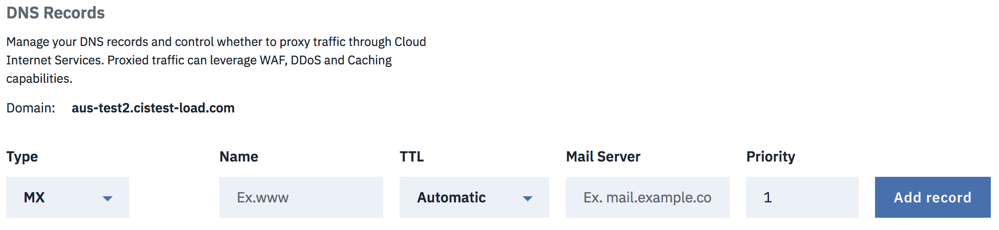
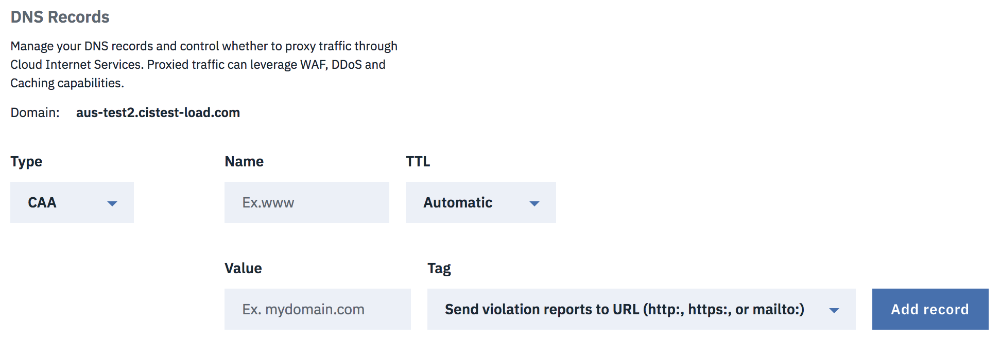
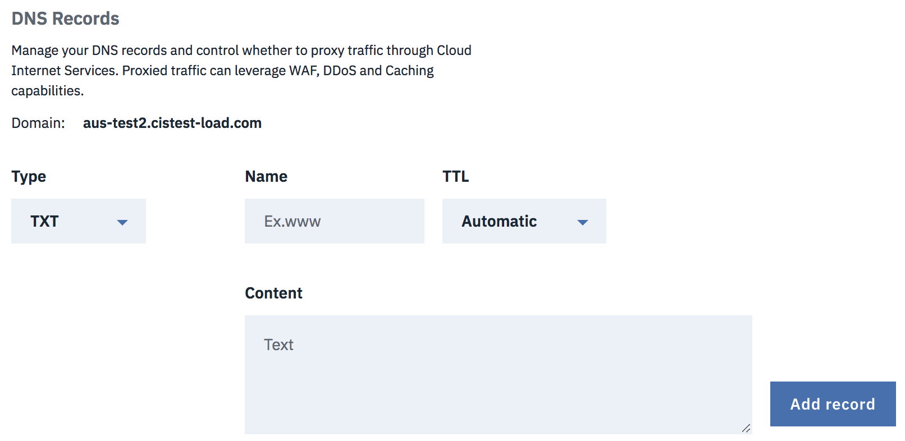
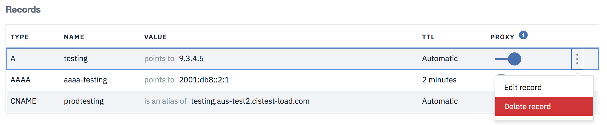

---

copyright:
  years: 2018
lastupdated: "2018-02-26"

---

{:shortdesc: .shortdesc}
{:new_window: target="_blank"}
{:codeblock: .codeblock}
{:pre: .pre}
{:screen: .screen}
{:tip: .tip}
{:download: .download}

# Setting up your Domain Name System (DNS) for IBM CIS

This document contains some concepts and definitions related to the internet's domain name system (DNS) and how it affects your IBM Cloud Internet Sservices (CIS) deployment. You'll find specific instructions about how to configure your IBM CIS DNS records, including how to configure Secure DNS.

## DNS concepts

The Domain Name System (DNS) underpins the web we use every day. It works transparently in the background, converting human-readable website names into computer-readable, numerical IP addresses that follow the [internet's RFC 1918 guidelines for IPv4 and RFC 4193 for IPv6](https://en.wikipedia.org/wiki/Private_network). In short, DNS servers match domain names, such as 'ibm.com', to their associated IP addresses, which most people do not need to know.

The DNS system looks up this IP address and host name information on a network of linked DNS servers across the internet, similarly to how people might look for someplace using a phone book or a map.

### Name Servers
A **name server** implements services that provide responses to queries against a directory service. It translates meaningful, text-based web or host identifiers into IP addresses.

**Name server delegation** takes place when a name server for a domain receives a request for a subdomain's records and responds with the name server's reference to the delegate server. This capability allows you to decentralize the management of a large domain (such as `ibm.com`).

A **custom domain name server** allows you to utilize the DNS provider's servers with the customized reference name of your own domain. For example, you can define your name server to be `ns1.cloud.ibm.com` instead of `ns1.acme.com`.

## Secure DNS

**DNSSec** is a technology to digitally 'sign' DNS data so you can be assured it is valid. To eliminate vulnerability from the internet, DNSSec must be deployed at each step in the lookup, from root zone to final domain name (for example, www.icann.org).

## Configuring and managing your secure DNS 

DNSSec adds a layer of authentication to the internet's DNS infrastructure, which otherwise is not secure. Secure DNS guarantees that visitors are directed to **your** web server when they type your domain name into a web browser.  All you need to do is enable DNSSec in your DNS page from your IBM CIS account and add the DS record to your registrar.

You can click **View DS records** button which will open up a dialog. It explains how to add the DS record to your registrar. You will need to copy parts of the DS record and paste them into your registrar’s dashboard. Every registrar is different, and your registrar may only require you to enter information for some of the available fields.

## Adding DNS records

You can use the **Type** dropdown to select the type of record you want to create. Each DNS record type has a Name and Time-To-Live (TTL) associated with it. 

Whatever is entered into the Name field will have domain name appended to it unless domain name is manually appended in the field already (e.g. if `www` or `www.example.com` is typed into the field, the API will handle both as `www.example.com`). If the exact domain name is typed into the name field, then it won't be appended on itself (e.g. `example.com` will be handled as `example.com`). However, the list of DNS records will only show the names without the domain name being tacked on, so `www.example.com` is shown as `www` and `example.com` will be shown as `example.com`. The TTL will have a default value of `Automatic`, but can be changed by the user. A proxied DNS record will always have a TTL of `Automatic`, so a newly proxied record will change to this configuration during this change.

### A Type record

To add this record type, valid values must exist in the **Name** and **IPv4 Address** fields. A **TTL** also can be specified from the dropdown, with a default value of 'Automatic'.

    Required Fields: Name, IPv4 Address
    Optional Field: TTL (Default value is Automatic)

### AAAA Type record

To add this record type, valid values must exist in the **Name** and **IPv6 Address** fields. A **TTL** also can be specified from the dropdown, with the default value of 'Automatic'.

    Required Fields: Name, IPv6 Address
    Optional Field: TTL (Default value is Automatic)

### CNAME Type record

To add this record type, a valid value must exist in the **Name** field and a fully qualified domain in the **Domain Name** (FQDN) field. A **TTL** also can be specified from the dropdown, with the default value of 'Automatic'.

    Required Fields: Name, Domain Name (for CNAME)
    Optional Field: TTL (Default value is Automatic)

### MX Type record

To add this record type, there must be a valid value in the **Name** field and a valid address in the **Mail Server** field. A **TTL** can also be specified from the dropdown, with the default value for this being 'Automatic'.

    Required Fields: Name, Mail Server
    Optional Fields: TTL (Default value is Automatic), Priority (Default value is 1)

### LOC Type record

To add this record type, there must be a valid value in the **Name** field. There is also a **Configure LOC options** button, which will open a dialog to update more specific information. A **TTL** can also be specified from the dropdown, with the default value for this being 'Automatic'.

    Required Fields: Name
    Optional Fields: LOC options (click the button to configure)

### CAA Type record

To add this record type, there must be valid values in the **Name** and **Value** fields. Value will correlate to the value of the **Tag** dropdown field, which defaults to "Send violation reports to URL". A **TTL** can also be specified from the dropdown, with the default value for this being 'Automatic'.

    Required Fields: Name, Value (associated to tag)
    Optional Fields: TTL (Default value is Automatic), Tag (default is to send violation reports to URL)

### SRV Type record

To add this record type, there must be valid values in the **Name**, **Service Name** and **Target** fields. A **protocol** can also be selected via dropdown, with the default value being UDP protocol. Additionally, **Priority**, **Weight** and **Port** can all be specified by the user and all three of these fields default to 1 from the start. A **TTL** can also be specified from the dropdown, with the default value for this being 'Automatic'.

    Required Fields: Name, Service Name, Target
    Optional Fields: TTL (Default value is Automatic), Protocol (Defaulted to UDP), Priority (Defaulted to 1), Weight (Defaulted to 1), Port (Defaulted to 1)

### SPF Type record

To add this record type, there must be valid values in the **Name** and **Content** fields. A **TTL** can also be specified from the dropdown, with the default value for this being 'Automatic'.

    Required Fields: Name, Content
    Optional Field: TTL (Default value is Automatic)

### TXT Type record

To add this record type, there must be valid values in the **Name** and **Content** fields. A **TTL** can also be specified from the dropdown, with the default value for this being 'Automatic'.

    Required Fields: Name, Content
    Optional Field: TTL (Default value is Automatic)

### NS Type record

To add this record type, there must be valid values in the **Name** and **Name Server** fields. A **TTL** can also be specified from the dropdown, with the default value for this being 'Automatic'.

    Required Fields: Name, Name Server
    Optional Field: TTL (Default value is Automatic)

## Updating DNS records

In each record row, you can click the **Edit record** option from the menu, which will open a dialog and you can use it to update the record.

For example, this is the update dialog for **A** type record. Once you are done with your changes, click **Update record** to save your changes.

## Deleting records

In each record row, you can click the **Delete record** option from the menu, which will open a dialog to confirm the delete process.

You can click the **Delete** button to confirm your delete action. You can click **Cancel** if you don't want to delete.

