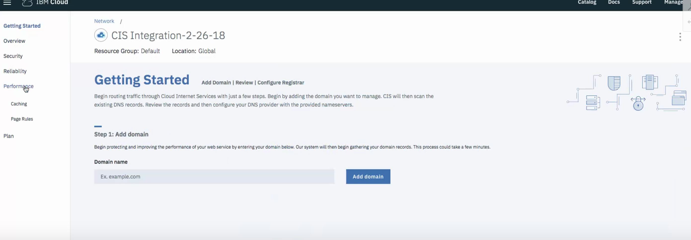

---
copyright:
  years: 2018
lastupdated: "2018-02-28"
---

{:shortdesc: .shortdesc}
{:new_window: target="_blank"}

# Getting Started with IBM Cloud Internet Services (CIS)

IBM CIS offers three main capabilities to enhance your workflow: [security](managing-for-security.html), [reliability](managing-for-reliability.html), and [performance](managing-for-performance.html). 

You can start using IBM Cloud Internet Services (CIS) for your internet traffic with just a few steps. 

 * Start by adding the domain you want to manage. 
 * IBM Cloud CIS scans the existing DNS records. 
 * Review the records and then configure your DNS provider with the provided nameservers.
 
## Process overview:

To begin, open your IBM Cloud dashboard and find the CIS application icon. For the Early Access release, there is only one plan and it is free. Click the "Create" button to begin provisioning your account.

You'll see the first screen of the CIS application, where you'll select the "Add Domain" button to begin.

**Step 1. Add and configure your Domain.**

Begin protecting and improving the performance of your web service by entering your domain or a subdomain. When you select "Add Domain" our system begins gathering your domain records, if any. It could take a few minutes for your domain to be created.

Meanwhile, the Overview screen will show your domain in "Pending" status.

**Step 2. (Optional) Review and verify your Domain's DNS Records.**

Now that your domain records have been gathered, verify they are correct. You may also upload a DNS File, if you have one. When you are ready, click **Continue** to go to the next step.

**Step 3. Configure your nameserver with the Registrar or DNS Provider.** 

To begin receiving the benefits of IBM CIS, configure your registrar or domain name provider to use the name servers listed. If you're delegating a domain (something like `example.com`), configure the listed name servers in your domain's settings managed by your registrar (for example, on the registrar's web portal). If you are delegating a subdomain (for instance, `subdomain.example.com`) from another DNS provider, you must add a Name Server (ns) record for each of the listed name servers.

After you've configured your registrar or DNS provider, it may take up to 24 hours for the changes to take effect.

**Step 4. In the meantime, you can go to the Overview page to begin managing other CIS functions and features.**

For more details about managing other functions and features, please see the [step-by-step instructions](how-to.html).
