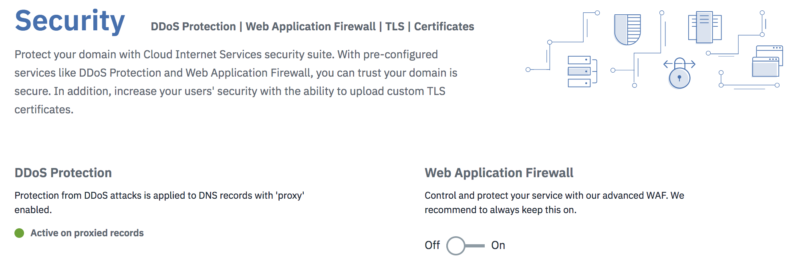

---
copyright:
  years: 2018
lastupdated: "2018-02-16"
---

{:shortdesc: .shortdesc}
{:new_window: target="_blank"}

# Getting Started

You can start routing traffic through IBM Cloud Internet Services (CIS) with just a few steps. 

 * Start by adding the domain you want to manage. 
 * IBM Cloud CIS scans the existing DNS records. 
 * Review the records and then configure your DNS provider with the provided nameservers.
 
 ## Step by step procedure:

To begin, open your IBM Cloud dashboard and find the CIS application icon. For the Beta release, there is only one plan and it is free. Click the "Create" button to begin provisioning your account.

**Step 1. Add and configure your Domain:**

Begin protecting and improving the performance of your web service by entering your domain. Our system begins gathering your domain records. This process could take a few minutes.

**Step 2. Review and verify your Domain's DNS Records:**

Now that your domain records have been gathered, verify they are correct. You may also upload a DNS File, if you have one. When you are ready, click **Continue** to go to the next step.

**Step 3. Configure your nameserver with the Registrar or DNS Provider:** 

To begin receiving the benefits of CIS, you must configure your domain name provider to use the name servers listed. We've provided customized IBM nameservers right now. For more detailed instructions, see **LINK TO EVENTUAL CONFIGURING DNS TOPIC**. 

After you've configured your registrar or DNS provider, it may take up to 24 hours for the changes to take effect. 

**Step 5.** In the meantime, you can go to the Overview page to begin managing additional CIS functionality.

On the Overview screen, you'll see that your domain name configuration is in **Pending** status.

## Configuring and managing your DNS

**Step 6.** Go to your DNS page and add a record (most likely an A record). Type in the information about your DNS record and then click `Add record` to implement your changes.

## Set up and manage your caching

**Step 7.** Next, you can set up caching. 

You have the option of 4 types of caching, available form the caching screen dropdown menu: 

 * No q.s.
 * q.s. independent
 * q.s
 * ??
 
 ### Purge Cache
 
At any time you can purge your cache to make way for updates by entering the URL into the purge cache field. You can purge individual files or up to 30 files at once.
 
 ## Cache expiration
 
You can use the dropdown menu to select the time of cache expiration that you require, for example 8 hours, or 1 day.

 
 ## Development Mode
 
Development mode is intended for use when major updates or new file uploads are required, so you do not want the end users to work from the cache at all, but to retrieve files directly from the origin servers. Development mode expires automatically after 3 hours.

To begin using Development Mode, toggle the switch to "Enabled" position. To stop using Development Mode, toggle the switch to "Disabled" position.

## Managing your Page Rules
 
You can enable 50 page rules per page. Use the drop down menus to configure the page rules. 

Notice that when certain rules are enabled, other options become grayed out, if they are in conflict with the other rules you've just selected. after you've selecteed the Page Rules you desire, click "Provision" to enable them. They will take effect immediately, and they can be viewed immediately on the Overview screen.
 
 
 
 You also can enable or disable your page rules from the table displayed in the Overview screen.
 
 ## Security settings
 
By default, DDoS protection is enabled for all IBM Cloud CIS accounts. Also, IBM Cloud CIS provides 25 default rules for WAF, which you can toggle on and off as you desire, or you can upload your own WAF rules. The 25 rules are enabled for you, even if you have no DNS records in our DNS management system. When you toggle the rules on or off, the changes are applied immediately.

## Certificates

When you deploy into a Zone, IBM Cloud CIS automatically deploys a universal certificate for that zone. Thus, you don't need to do anything to have certificate-based protection in that zone. If you desire, you can upload your own certificate. You'll need a separate certificate for each zone, and you'll see an error message if the certificate you are uploading does not match your zone.
 
 ## Set up and configure your load balancers
 
 IBM Cloud CIS provides global load balancing as a service.

