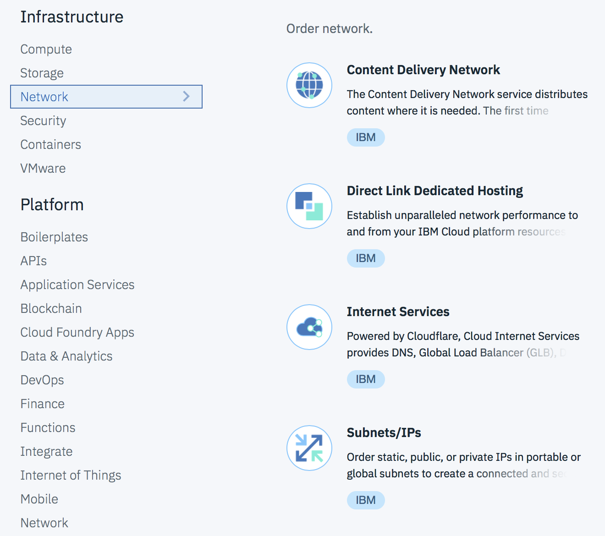

---
copyright:
  years: 2018
lastupdated: "2018-03-05"
---

{:shortdesc: .shortdesc}
{:new_window: target="_blank"}

# Getting Started with IBM Cloud Internet Services (CIS)

IBM CIS offers three main capabilities to enhance your workflow: [security](managing-for-security.html), [reliability](managing-for-reliability.html), and [performance](managing-for-performance.html).

You can start using IBM Cloud Internet Services (CIS) for your internet traffic with just a few steps.

 * Open the CIS application from your IBM Cloud dashboard
 * Add the domain you want to manage.
 * IBM Cloud CIS scans the existing DNS records.
 * Review the records and then configure your DNS provider with the provided Name Servers.

**Step 1: Open the CIS application 

To begin, open your IBM Cloud dashboard and find the CIS application icon under the **Platform -> Network** category.

For the Early Access release, there is only one plan and it is free. Click the "Create" button to begin provisioning your account.

You'll see the first screen of the CIS application, where you'll select the "Add Domain" button to begin.

**Step 2. Add and configure your Domain.**

Begin protecting and improving the performance of your web service by entering your domain or a subdomain. When you select "Add Domain" our system begins gathering your domain records, if any. It could take a few minutes for your domain to be created.

Meanwhile, the Overview screen will show your domain in "Pending" status.

**Step 3. (Optional) Review, verify and add your Domain's DNS Records.**

You can select the "Reliability" link from the left navigation panel on your screen, then click "DNS" to see the DNS page.

Now that your domain records have been gathered, verify that they are correct. Make sure that your old DNS records are added to the domain name. You also may add new DNS records.

**Step 4. Configure your Name Servers with the Registrar or existing DNS Provider.**

To begin receiving the benefits of IBM CIS, configure your registrar or domain name provider to use the name servers listed. If you're delegating a domain (something like `example.com`), configure the listed name servers in your domain's settings, where they are managed by your registrar (for example, on the registrar's web portal). If you delegate a subdomain (for instance, `subdomain.example.com`) from another DNS provider, you must add a Name Server (NS) record for each of the listed Name Servers.

After you've configured your registrar or DNS provider, it may require up to 24 hours for the changes to take effect.

**Step 5. In the meantime, you can begin managing other CIS functions and features.**

For more details about managing other functions and features, please see our [tutorial]() or the [step-by-step instructions](how-to.html).
