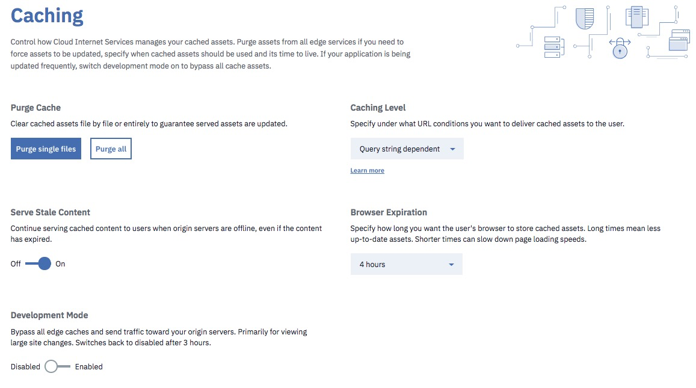
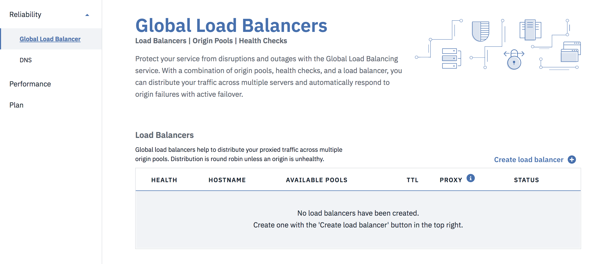

---
copyright:
  years: 2018
lastupdated: "2018-02-16"
---

{:shortdesc: .shortdesc}
{:new_window: target="_blank"}

# Managing your IBM Cloud CIS deployment

You'll begin by using the Overview screen as your working base of operations. It shows all of the current parameters for your deployment.

Once you've set up your DNS and configured it, you are ready to go!

## Using the Overview screen

Using  the Overview screen, you can see the status of all your selections. You can change the settings directly from the Overview screen, just click on the underlined name of the setting you'd like to change, for example, you could click on the `Load Balancers` field to add a Load Balancer.

On the Overview screen, you may see that your domain name configuration is in **Pending** status, or in **Active** status as shown in the following figure.

## Configuring and managing your DNS

Go to your DNS page and add a record (most likely an A record). Type in the information about your DNS record and then click `Add record` to implement your changes.

## Set up and manage your caching

Next, you can set up caching. 

You have the option of 3 types of caching, available from the caching screen dropdown menu: 

 * No query string :  Only delivers resources from cache when there is no query string.
 * Query string independent : Delivers the same resource to everyone independent of the query string. (Note: The Ignore Query String setting applies only to static file extensions. This setting removes the query string when generating the cache key, so that a request for `style.css?something` is normalized to `style.css` when serving from the cache.)
 * Query string dependent : Delivers a different resource each time the query string changes.
  
## Purge Cache
 
At any time you can purge your cache to make way for updates by entering the URL into the purge cache field. You can purge a single file or multiple files (up to 30 at a time).
 
 ## Cache expiration
 
You can use the dropdown menu to select the time of cache expiration that you require, for example 8 hours, or 1 day.

 
 ## Using Development Mode
 
Development mode is intended for use when major updates or new file uploads are required, so you do not want the end users to work from the cache at all, but to retrieve files directly from the origin servers. Development mode expires automatically after 3 hours.

To begin using Development Mode, toggle the switch to "Enabled" position. To stop using Development Mode, toggle the switch to "Disabled" position.

## Managing your Page Rules
 
You can enable 50 Page Rules per page. Use the drop down menus to configure the Page Rules. The Page Rules are divided into three categories: Security, Performance, and Reliability.

Notice that when certain rules are enabled, other options become grayed out, if they are in conflict with the other rules you've just selected. After you've selected the Page Rules you desire, click "Provision" to enable them. They will take effect immediately, and they can be viewed immediately on the Overview screen.
 
 
 
 You also can enable or disable your Page Rules from the table displayed in the Overview screen. See [Using Page Rules](using-page-rules.html) for more information.
 
 ## Security settings
 
By default, DDoS protection is enabled for all IBM Cloud CIS accounts. Also, IBM Cloud CIS provides 25 default rules for WAF, which you can toggle on and off as you desire, or you can upload your own WAF rules. The 25 rules are enabled for you, even if you have no DNS records in our DNS management system. When you toggle the rules on or off, the changes are applied immediately.

## Certificates

When you deploy into a Zone, IBM Cloud CIS automatically deploys a universal certificate for that zone. Thus, you don't need to do anything to have certificate-based protection in that zone. If you desire, you can upload your own certificate. You'll need a separate certificate for each zone, and you'll see an error message if the certificate you are uploading does not match your zone.
 
 ## Set up and configure your load balancers
 
 IBM Cloud CIS provides global load balancing as a service.

