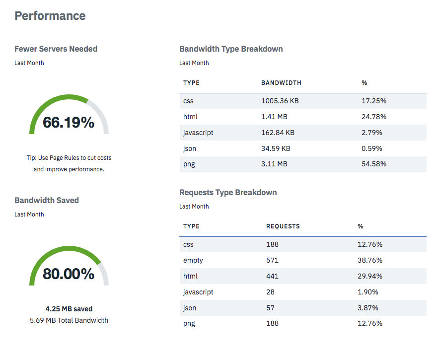
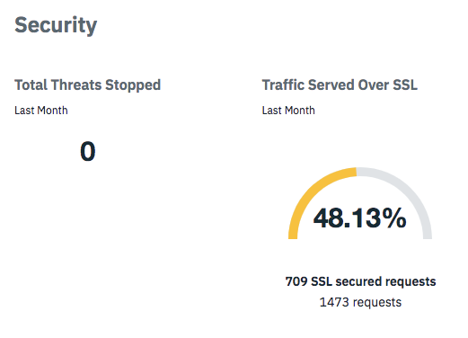
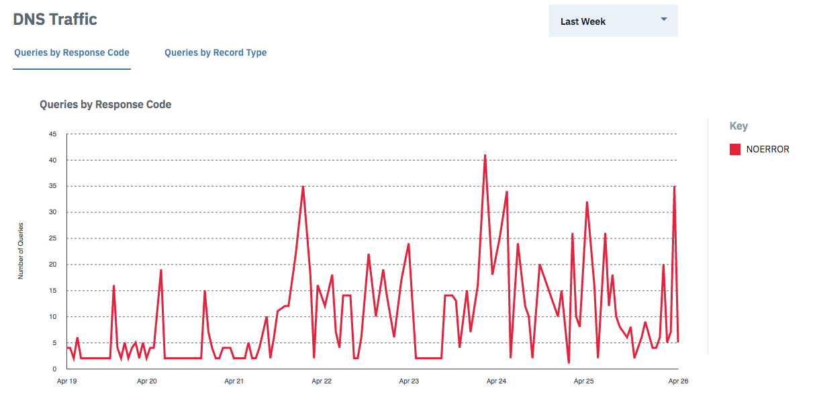

---
copyright:
  years: 2018
lastupdated: "2018-04-26"
---

# Metrics

CIS Metrics can be accessed from the side navigation. Information about Domain and DNS metrics is displayed in easy-to-digest charts and tables. The smallest increment Metrics can be viewed in is 6 hours.
    
**Note:** In all charts, only the top ten items are displayed. You can click on the items in the key to toggle the display of that item.

## Domain Metrics
Domain Metrics is a series of charts, tables, and graphes that show web traffic, performance, and security information.
**Note**: Domain Metrics can retrieve up to 90 days at one time, but retrieving 3 different 30-day ranges is quicker.

### Web Traffic
Web Traffic is a set of five tabs that show you helpful information about the traffic to your website. 
* **Requests** shows cached and uncached requests made on the domain.
* **Bandwidth** shows cached and uncached bandwidth in bytes. 
* **Unique Visitors** shows the number of unique visitors to the site.
* **Threats** shows the total number of threats that are blocked.
* **Status Codes** shows the different HTTP status codes returned to the end users.

### Performance

* **Fewer Servers Needed** is a percentage, and is a rough estimate of how much less capacity you need in order to handle your site’s traffic. It's based on the number of requests and bandwidth saved by using CIS, and is intended to help you see how much web traffic we're saving from going to your origin server.

* **Bandwidth Saved** is a percentage that shows how much bandwidth was saved by using CIS, and is used in calculating the **Fewer Servers Needed** metric.

### Security
Security is a chart that shows the number of threats stopped. 

## DNS Metrics
DNS Metrics is a series of charts that cover DNS traffic and the top queried DNS records.

### Traffic
The Traffic section has two tabs that display **Queries by Response Code** and **Queries by Record Type**. Use the dropdown menu to select the date range displayed.

### Top queried DNS records
This table contains a paginated list of the most-queried DNS records, in descending order. It shows the name and type of the record, and the number of queries received.

### Top DNS records returning NXDOMAIN
This table contains a paginated list of the requests made to non-existent internet domains, in descending order. It shows the name and type of the record, and the number of queries received. If there are no NXDOMAIN responses, this chart will be empty.
