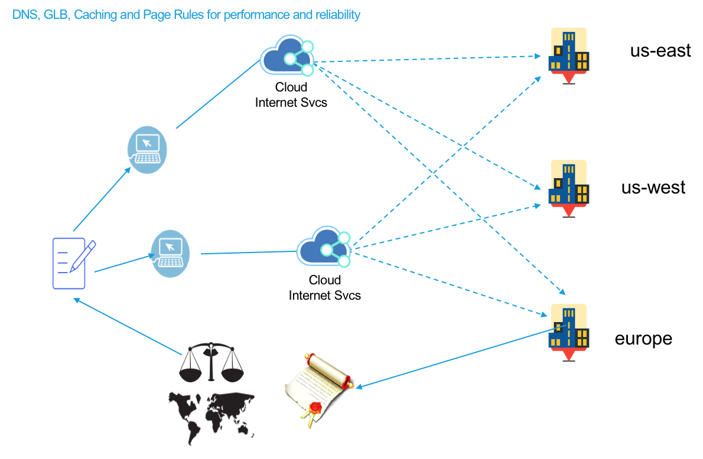

---
copyright:
  years: 2018
lastupdated: "2018-03-05"
---

{:shortdesc: .shortdesc}
{:new_window: target="_blank"}

# How IBM CIS optimizes your services

IBM CIS improves your web services and applications performance by leveraging Global Load Balancing, Content Optimization through Page Rules, and Caching. Web performance is more than just moving static files closer to visitors; it is about ensuring that every page renders as fast and efficiently as possible. By protecting your origin servers from spammers, bots, and malicious crawlers, you save your origin’s resources which improves your customer experience.

Here’s a quick feature overview:

## Performance features

 * Caching 
 * Global Load Balancing 
 * Page Rules to fine tune caching behavior and content optimization

**Summary**

 * With Caching and Page Rules settings, you can enhance your web services and application performance
 * With Global Load Balancing, your customers are serviced from your closest origin servers improving your customer experience
