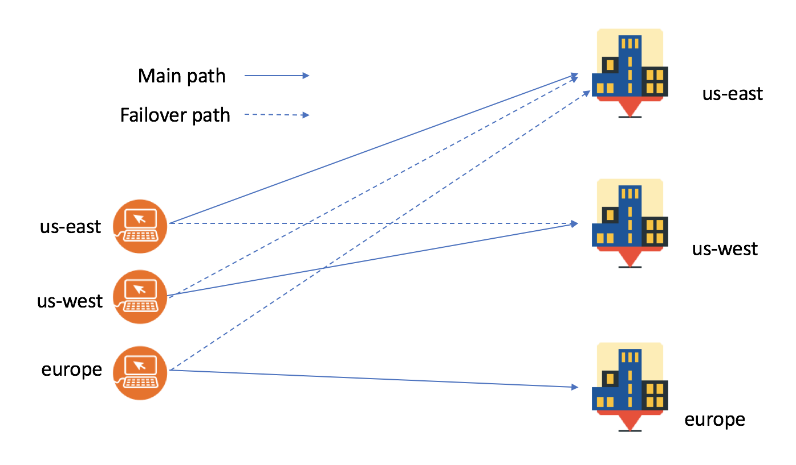

---
copyright:
  years: 2018
lastupdated: "2018-03-05"
---

{:shortdesc: .shortdesc}
{:new_window: target="_blank"}

# How IBM CIS keeps your work reliable

IBM CIS improves your web services and applications reliability by avoiding downtime caused caused by application and network outages. With Global Load Balancing you can deploy your web services and applications in multiple regions. IBM CIS routes your customer requests to the closest regions available when Global Load Balancing is enabled. If any region fails, the requests are routed to the next closest location, thereby your customers will not be impacted by downtime.  You can sleep well at night knowing we are keeping your website or API running. IBM CIS will automatically send you notifications when your website or API fails and when it is restored.

Here’s a quick feature overview:

## Reliability features

 * Global load balancing 
 * Proxy and non-proxy options for load balancing
 * Origin pools and health monitors
 * DNS management
 
 **Summary**
 
  * Health monitors check if your origin pools are healthy
  * In case of health monitor failure, customer requests are re-routed to healthy origins
  * You stay informed when your web service or API fails and when it is restored
