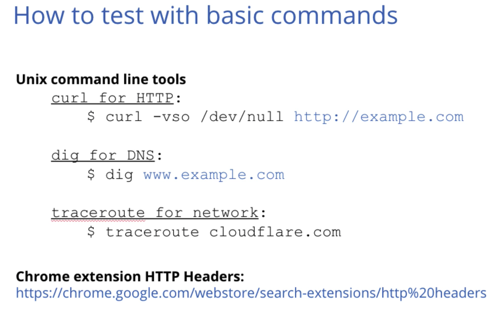
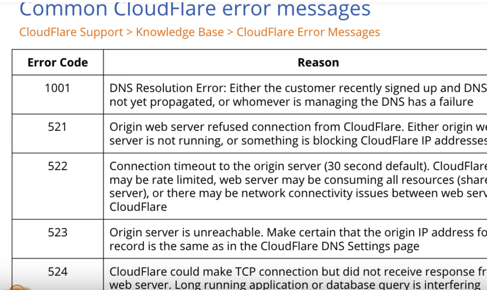
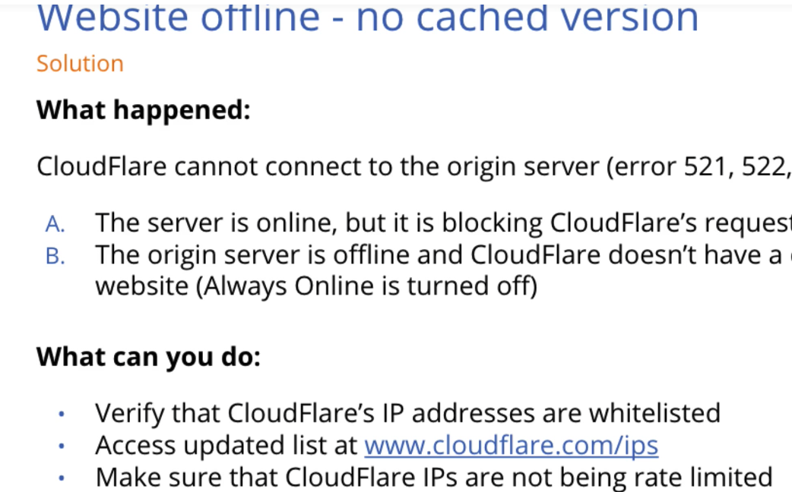
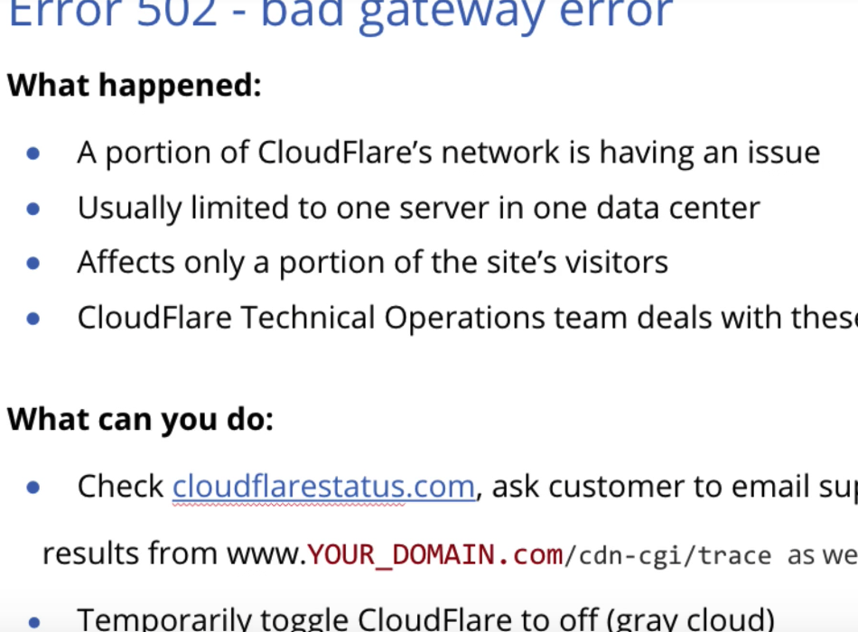

---
copyright:
  years: 2018
lastupdated: "2018-02-13"
---

{:shortdesc: .shortdesc}
{:new_window: target="_blank"}

# Troubleshooting your CIS network connection

## How do I know if my data is passing through my IBM Cloud CIS connection?

IBM Cloud CIS uses HTTP headers, which it can read, add, or modify. The header lets us trace how a request was routed, using a CF-Ray number. The CF-Ray number can be found by a `curl` comand or with a Google Chrome plug in called "Claire".

To know whether data has passed through IBM Cloud CIS, you need to locate the “Ray ID” which will be present on every packet.

**For example:**

Terminal command:  `curl -svo /dev/null YOUR_URL_HERE. -L`

Results in: `CF-RAY: 1ca349b6c1300da3-SJC`

## How do I trace a route?

To see whether a route goes through your IBM Cloud CIS pathway, you can
perform a ‘dig’ in a Terminal window for Mac or Linux
or use ‘nslookup’ in the Windows command prompt for Windows.

If the packet has a CF-Ray value, then it has travelled through CIS.

The `traceroute` command shows the entire path that an IP request has taken.

The support team makes use of these commands to assist you.

## How can I check the network status of IBM Cloud CIS overall?

You can check the overall network status at  www.cloudflarestatus.com.

## If you see a privacy warning:

The SSL certificates issued by IBM Cloud CIS (CloudFlare) cover the root domain (example.com) and one level of subdomain (*.example.com). If you’re trying to reach a second-level subdomain (*.*.example.com) you will see a privacy warning in your browser, because these host names are not added to the SAN.

Also, please allow up to 15 minutes for one of our partner Certificates Authorities (CAs) to issue a new certificate. You’ll see a privacy warning in your browser if your new certificate has not yet been issued.

## What do I do if I’m under a DDoS attack?

 * **Step 1:** Turn on “I’m Under Attack!” mode from your dashboard
 * **Step 2:** Set your DNS records for maximum security
 * **Step 3:** Do not rate-limit or throttle requests from IBM CIS (CloudFlare)
 * **Step 4:** Block specific IP ranges, countries, and visitors as needed

During "I'm Under Attack!" mode, each new visitor is met with a "Captcha" security challenge, which they must pass before being given a cookie for unchallenged access. That way, botnet traffic is blocked until the "I'm Under Attack!" mode is turned off. Visitors that do not meet the security challenge are added to the (bad) IP Reputation database.

## Other problems you might encounter:

Here are some common error messages that you or your support team might see:

### Not seeing any network traffic

If you’re not seeing traffic, and you’re using a CNAME, make sure that there is a redirect in place, so the traffic is not being routed to the root domain. Remember that some DNS propagations can take up to 48 hours to complete.

### Website offline

Here is what you might see:

### 502 error “The dreaded 502”

This error typically occurs at the start of a DDoS attack. A particular data center may be unavailable for a time. Traffic will be re-routed. Run a trace route or check the status page. 

